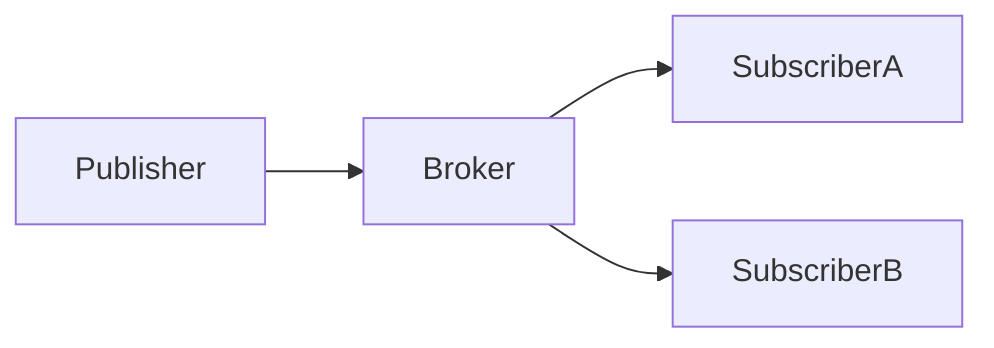

**Tags:** #pattern/pubsub #eventing #distributed-systems

### Concept
Publishers emit events to a **broker** without knowing subscribers. Subscribers receive messages based on **topics**.
### Key Components

- Publisher
- Broker (Kafka, RabbitMQ, Redis)
- Subscriber
### Mermaid Diagram

`

### Use Cases

- Notification systems
- Real-time analytics
- Microservices communication
### Pros / Cons

**Pros**
- Loose coupling
- Highly scalable
**Cons**
- Harder debugging
- Event ordering issues