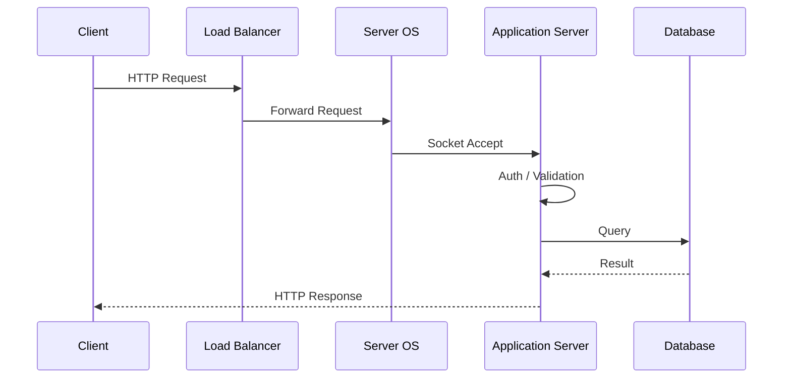

#backend #architecture #server

> A **server** is a long-running process (or set of processes) that:
- Listens on a **network interface**
- Accepts **requests** over a protocol
- Executes **business logic**
- Interacts with **stateful systems**
- Returns **responses** with latency, reliability, and security guarantees
---
A **server is not hardware** — it’s a **process bound to ports and resources**.

What Actually Happens When a Request Hits a Server ?

