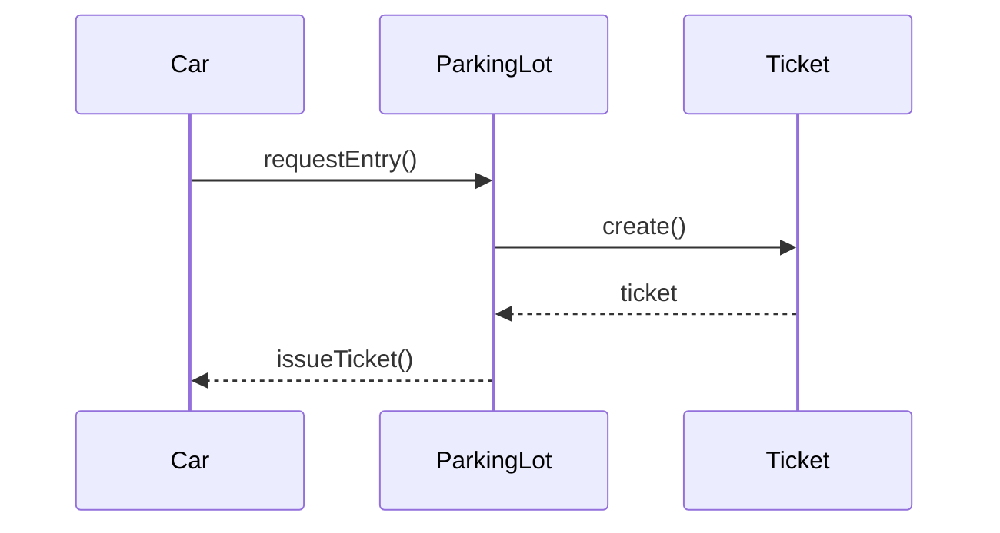

**Tags:** #lld #oop #backend #software-design`  

---

## 1. What Problem Does LLD Actually Solve?

LLD solves **code-level complexity**.
As systems grow:
- Logic gets scattered
- Changes become risky
- One feature breaks another
LLD helps you design code that is:
- **Readable**
- **Maintainable**
- **Extensible**
- **Testable**
> LLD is not about writing code fast  
> LLD is about **designing code that survives change**
---
## 2. The Fundamental Unit of LLD: Responsibility
### Key Rule (Golden Rule of LLD)
> **Design around responsibilities, not classes**

A **responsibility** is:
- A reason for a piece of code to exist
- A specific behavior the system must perform
### Examples of responsibilities:
- Calculate price
- Validate input
- Persist data
- Send notification
- Allocate resources
    
❌ Wrong thinking:
> “I need a `UserManager` class”

✅ Correct thinking:
> “Someone must validate users”  
> “Someone must store users”  
> “Someone must authenticate users”

---
## 3. What Is an Object (LLD Definition)?

An **object** is:
> A unit that **owns data** and **performs behavior** related to that data

### Object = Data + Behavior + Responsibility
Example:
- `Car`
    - Data: number, type
    - Behavior: assignSlot(), releaseSlot()
    - Responsibility: represent a vehicle
---

## 4. What Is a Class Then?

A **class** is just:
> A blueprint to create objects with the same responsibilities

In LLD:
- Classes are **containers for responsibilities**
- Classes should be **small and focused**
---
## 5. Single Responsibility Principle (SRP) — From Day 1

> **A class should have exactly one reason to change**

### Example (Bad Design)

```text
UserService
- createUser()
- validateEmail()
- saveToDatabase()
- sendWelcomeEmail()
```

❌ Problems:

- Validation change → class changes
- DB change → class changes
- Email change → class changes
### Improved Design

```text
UserValidator      → validate user
UserRepository     → save user
EmailService       → send email
UserService        → orchestrates flow
```

Each class has **one responsibility**.

---
## 6. Identifying Objects from a Problem Statement

### Step-by-step method (VERY IMPORTANT):
1. **Underline nouns** → candidates for objects
2. **Underline verbs** → candidates for responsibilities
3. Group responsibilities logically
4. Assign one group → one class
---
### Example Problem
> “A system issues tickets to cars entering a parking lot”
- Nouns:
    - Car
    - Ticket
    - ParkingLot
- Verbs:
    - issue
    - enter
    - park
### Resulting Objects
- `Car` → represents vehicle
- `Ticket` → represents parking record
- `ParkingLot` → manages slots
---
## 7. Object Interaction (Core LLD Skill)
Objects should:
- **Collaborate**
- **Not control each other internally**
### Rule:
> Objects **talk via methods**, not by accessing internal data
---
### Example Flow



Key idea:
- `Car` does NOT create `Ticket`
- Responsibility belongs to `ParkingLot`
---

## 8. Encapsulation (Why It Exists)

Encapsulation means:
- Internal state is hidden
- Only valid operations are allowe
### Example

❌ Bad:
```java
ticket.entryTime = -100;
```

✅ Good:

```java
ticket.markEntryTime(now);
```

Encapsulation prevents:

- Invalid states
- Tight coupling
- Debug nightmares
---
## 9. Composition Over Inheritance (Early Insight)

> Prefer **has-a** over **is-a**
### Example

❌ Bad:

```text
ElectricCar extends Car extends Vehicle extends Object
```

Problems:

- Rigid hierarchy
- Hard to change behavior
✅ Better:

```text
Car has Engine
ElectricCar has Battery
```

Behavior changes via **composition**, not inheritance.

---
## 10. Minimal Code Example (Mental Model)

```java
class Ticket {
    private final String id;
    private final Instant entryTime;

    Ticket(String id) {
        this.id = id;
        this.entryTime = Instant.now();
    }

    Instant getEntryTime() {
        return entryTime;
    }
}
```

Notice:

- No extra logic
- One responsibility
- Immutable where possible
---
## 11. Common Beginner Mistakes (Avoid These)

❌ God classes (`Manager`, `Helper`, `Utils`)  
❌ Classes with unrelated methods  
❌ Public fields  
❌ Inheritance everywhere  
❌ Thinking in database tables

---
## 12. Mental Checklist While Designing

Before writing any class, ask:
1. What responsibility does this have?
2. Does it have more than one reason to change?
3. Who should own this behavior?
4. Can this change independently?
---
## 13. Key Takeaway (Lock This In)

> **LLD = Assigning the right responsibility to the right object**
Everything else (patterns, SOLID, diagrams) builds on this.

---
### Next Note Options (Choose One)

1️⃣ **What makes a “good class” (data vs behavior)**  
2️⃣ **Relationships between objects (association, composition, dependency)**  
3️⃣ **Interfaces vs abstract classes (from scratch)**
