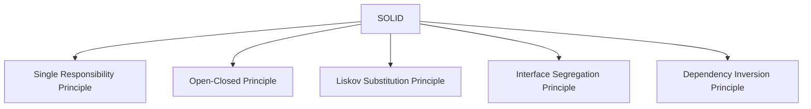
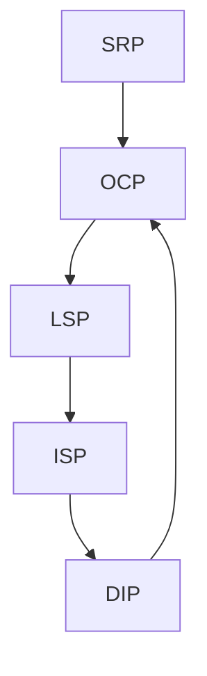

***Tags***: #lld #oops #SOLID #designpatterns

---
# SOLID Principles
## 1. Introduction to SOLID

**SOLID** is an acronym representing **five object-oriented design principles** introduced and popularized by **Robert C. Martin (Uncle Bob)**.  
These principles help engineers design systems that are:
- **Maintainable**
- **Extensible**
- **Testable**
- **Robust to change**
- **Loosely coupled**
### Why SOLID Exists
In real systems:
- Requirements change
- Features grow
- Teams scale
- Bugs appear in unexpected places
SOLID minimizes **change impact** by guiding **class responsibilities, dependencies, and abstractions**

---
## What SOLID Is _Not_

- ❌ Not a framework
- ❌ Not a language feature
- ❌ Not about performance optimization
- ❌ Not only for “large systems”
SOLID is about **design stability under change**.

---
## High-Level View of SOLID

---

---

# 7. How SOLID Principles Work Together

- SRP improves clarity
    
- OCP enables safe change
    
- LSP ensures correctness
    
- ISP reduces coupling
    
- DIP inverts dependency flow
    

---

# 8. Final Mental Model

|Principle|Focus|
|---|---|
|SRP|Responsibility|
|OCP|Extension|
|LSP|Substitutability|
|ISP|Interface granularity|
|DIP|Dependency direction|

---

