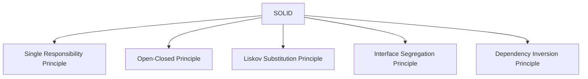
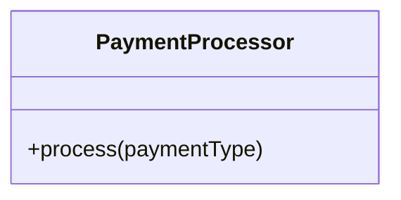
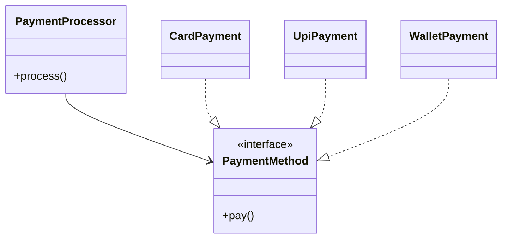
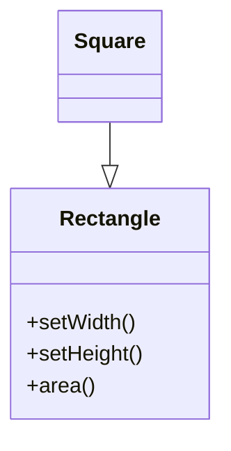
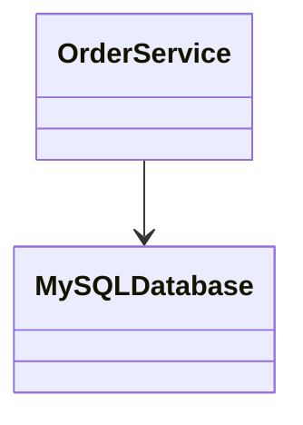
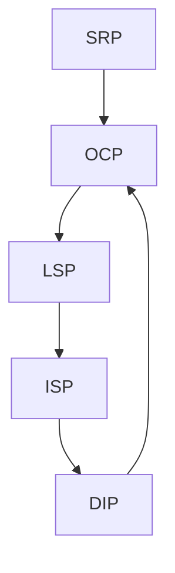

***Tags***: #lld #oops #SOLID #designpatterns

---
# SOLID Principles
## 1. Introduction to SOLID

**SOLID** is an acronym representing **five object-oriented design principles** introduced and popularized by **Robert C. Martin (Uncle Bob)**.  
These principles help engineers design systems that are:
- **Maintainable**
- **Extensible**
- **Testable**
- **Robust to change**
- **Loosely coupled**
### Why SOLID Exists
In real systems:
- Requirements change
- Features grow
- Teams scale
- Bugs appear in unexpected places
SOLID minimizes **change impact** by guiding **class responsibilities, dependencies, and abstractions**

---
## What SOLID Is _Not_

- ❌ Not a framework
- ❌ Not a language feature
- ❌ Not about performance optimization
- ❌ Not only for “large systems”
SOLID is about **design stability under change**.

---
## High-Level View of SOLID



---

# 3. Open–Closed Principle (OCP)
#### Definition
> **Software entities should be open for extension but closed for modification.**
## Meaning
- You **add new behavior**
- Without **changing existing, tested code**
This reduces **regression bugs**.
#### OCP Violation (Rigid Design)

Internally:
- `if paymentType == "CARD"`
- `else if paymentType == "UPI"`
- `else if paymentType == "WALLET"`
#### Problems
- Every new payment → modify class
- High risk of breaking existing logic
#### OCP-Compliant Design (Polymorphism)

#### Key Insight
OCP relies on:
- **Abstraction**
- **Polymorphism**
- **Dependency Inversion**
## OCP Tradeoff
- Slight increase in class count
- Massive gain in flexibility
---

# 4. Liskov Substitution Principle (LSP)

## Definition

> **Objects of a superclass should be replaceable with objects of a subclass without breaking correctness.**

---

## In Simple Terms

If `S` is a subtype of `T`, then:

- `T` can be replaced with `S`
    
- **Without changing expected behavior**
    

---

## Classic LSP Violation (Behavioral)



### Why This Breaks LSP

- Square **changes behavior expectations**
    
- Width and height can no longer vary independently
    
- Code written for Rectangle breaks with Square
    

---

## Correct LSP Design

```mermaid
classDiagram
    <<interface>> Shape
    Shape : +area()

    class Rectangle
    class Square

    Rectangle ..|> Shape
    Square ..|> Shape
```

---

## LSP Rules (Technical)

A subclass must:

- Not strengthen preconditions
    
- Not weaken postconditions
    
- Preserve invariants
    
- Preserve expected side effects
    

---

## LSP Smell

If you see:

- `isinstance`
    
- `type checks`
    
- defensive branching for subclasses
    

You likely violated LSP.

---

# 5. Interface Segregation Principle (ISP)

## Definition

> **Clients should not be forced to depend on interfaces they do not use.**

---

## Core Idea

- Prefer **small, role-specific interfaces**
    
- Avoid **fat interfaces**
    

---

## ISP Violation

```mermaid
classDiagram
    <<interface>> Worker {
        +work()
        +eat()
        +sleep()
    }

    class Robot
    Robot ..|> Worker
```

### Problem

- Robot does not eat or sleep
    
- Forced to implement meaningless methods
    

---

## ISP-Compliant Design

```mermaid
classDiagram
    <<interface>> Workable
    Workable : +work()

    <<interface>> Eatable
    Eatable : +eat()

    <<interface>> Sleepable
    Sleepable : +sleep()

    class Human
    class Robot

    Human ..|> Workable
    Human ..|> Eatable
    Human ..|> Sleepable

    Robot ..|> Workable
```

---

## Key Insight

ISP is about **client perspective**, not implementation convenience.

---

## ISP Smell

- Interfaces with many unrelated methods
    
- Frequent “empty” method implementations
    

---

# 6. Dependency Inversion Principle (DIP)

## Definition

> **High-level modules should not depend on low-level modules.  
> Both should depend on abstractions.**

---

## What DIP Fixes

- Tight coupling
    
- Rigid architectures
    
- Difficult testing
    

---

## DIP Violation



### Problems

- Database change impacts business logic
    
- Hard to mock for tests
    

---

## DIP-Compliant Design

```mermaid
classDiagram
    class OrderService

    <<interface>> Database
    Database : +save()

    class MySQLDatabase
    class PostgreSQLDatabase

    OrderService --> Database
    MySQLDatabase ..|> Database
    PostgreSQLDatabase ..|> Database
```

---

## Key Insight

DIP often enables:

- Dependency Injection
    
- Mocking
    
- Clean Architecture
    
- Hexagonal Architecture
    

---

# 7. How SOLID Principles Work Together



- SRP improves clarity
    
- OCP enables safe change
    
- LSP ensures correctness
    
- ISP reduces coupling
    
- DIP inverts dependency flow
    

---

# 8. Final Mental Model

|Principle|Focus|
|---|---|
|SRP|Responsibility|
|OCP|Extension|
|LSP|Substitutability|
|ISP|Interface granularity|
|DIP|Dependency direction|

---

If you want, next we can:

- Apply SOLID to a **real-world system**
    
- Show **before vs after architecture**
    
- Map SOLID to **Clean Architecture**
    
- Convert these notes into a **1-page cheat sheet**
    

Just tell me how you’d like to continue.