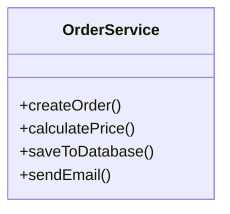
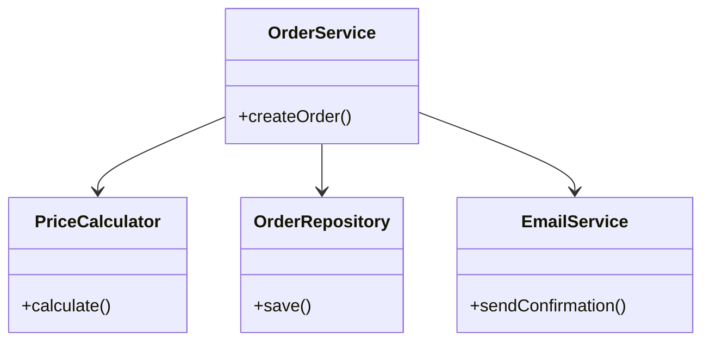

***Tags***: #lld #oops #SOLID #designpatterns

# 2. Single Responsibility Principle (SRP)
#### Definition
> **A class should have only one reason to change.**
This means:
- One **primary responsibility**
- One **axis of change**
- One **actor/stakeholder**
#### Core Idea
A class should **do one thing**, and **do it well**.
If a class changes for **multiple reasons**, it violates SRP.
#### SRP Violation Example (Conceptual)

#### Problems
- Business logic + persistence + communication are mixed
- Changes in DB, pricing rules, or email all affect same class
- Hard to test in isolation
#### SRP-Compliant Design

Now in the above compliant diagram each class will have an instance of the order class. We're using composition. 
#### Key Insight
SRP is **not about number of methods**  
It’s about **cohesion of responsibility**
#### SRP Checklist
Ask:
- Who requests changes to this class?
- Can multiple teams argue ownership?
- Does this class change for unrelated reasons?
If **yes**, SRP is violated.

---
### Code
####