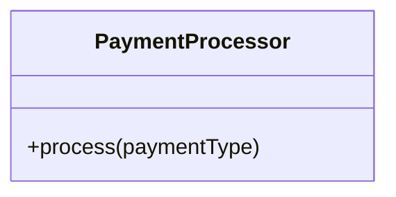
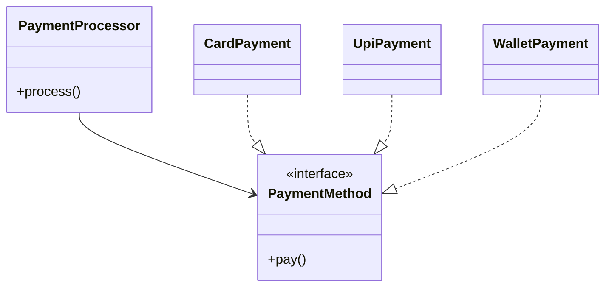

# 3. Open–Closed Principle (OCP)
#### Definition
> **Software entities should be open for extension but closed for modification.**
## Meaning
- You **add new behavior**
- Without **changing existing, tested code**
This reduces **regression bugs**.
#### OCP Violation (Rigid Design)

Internally:
- `if paymentType == "CARD"`
- `else if paymentType == "UPI"`
- `else if paymentType == "WALLET"`
#### Problems
- Every new payment → modify class
- High risk of breaking existing logic
#### OCP-Compliant Design (Polymorphism)

#### Key Insight
OCP relies on:
- **Abstraction**
- **Polymorphism**
- **Dependency Inversion**
## OCP Tradeoff
- Slight increase in class count
- Massive gain in flexibility
---
