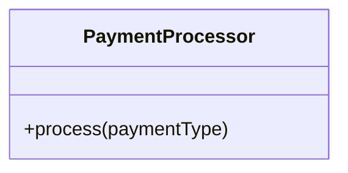
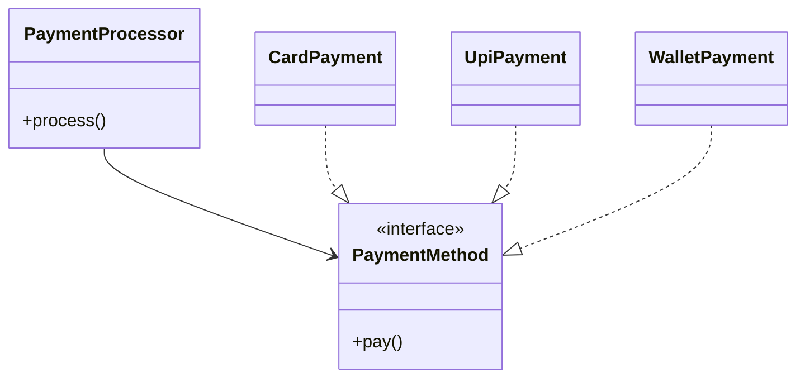

***Tags***: #lld #oops #SOLID #designpatterns
# 3. Open–Closed Principle (OCP)
#### Definition
> **Software entities should be open for extension but closed for modification.**
## Meaning
- You **add new behavior**
- Without **changing existing, tested code**
This reduces **regression bugs**.
#### OCP Violation (Rigid Design)

Internally:
- `if paymentType == "CARD"`
- `else if paymentType == "UPI"`
- `else if paymentType == "WALLET"`
#### Problems
- Every new payment → modify class
- High risk of breaking existing logic
#### OCP-Compliant Design (Polymorphism)

#### Key Insight
OCP relies on:
- **Abstraction**
- **Polymorphism**
- **Dependency Inversion**
## OCP Tradeoff
- Slight increase in class count
- Massive gain in flexibility
---
#### ❌ OCP Violation
```python
class PaymentProcessor:
    def process(self, payment_type):
        if payment_type == "card":
            print("Card payment")
        elif payment_type == "upi":
            print("UPI payment")

```

#### OCP-Compliant Design

```python
from abc import ABC, abstractmethod

class PaymentMethod(ABC):
    @abstractmethod
    def pay(self):
        pass


class CardPayment(PaymentMethod):
    def pay(self):
        print("Card payment")


class UPIPayment(PaymentMethod):
    def pay(self):
        print("UPI payment")


class PaymentProcessor:
    def __init__(self, payment_method: PaymentMethod):
        self.payment_method = payment_method

    def process(self):
        self.payment_method.pay()


payment = CardPayment()
processor = PaymentProcessor(payment)
processor.process()

# Extend without modification
payment = UPIPayment()
processor = PaymentProcessor(payment)
processor.process()

```