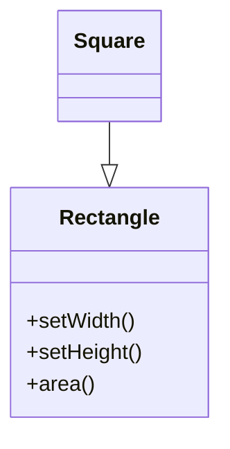

***Tags***: #lld #oops #SOLID #designpatterns
# 4. Liskov Substitution Principle (LSP)

## Definition
> **Objects of a superclass should be replaceable with objects of a subclass without breaking correctness.**
---
## In Simple Terms
If `S` is a subtype of `T`, then:
- `T` can be replaced with `S`
- **Without changing expected behavior**
---
## Classic LSP Violation (Behavioral)



### Why This Breaks LSP

- Square **changes behavior expectations**
    
- Width and height can no longer vary independently
    
- Code written for Rectangle breaks with Square
    

---

## Correct LSP Design

```mermaid
classDiagram
    <<interface>> Shape
    Shape : +area()

    class Rectangle
    class Square

    Rectangle ..|> Shape
    Square ..|> Shape
```

---

## LSP Rules (Technical)

A subclass must:

- Not strengthen preconditions
    
- Not weaken postconditions
    
- Preserve invariants
    
- Preserve expected side effects
    

---

## LSP Smell

If you see:

- `isinstance`
    
- `type checks`
    
- defensive branching for subclasses
    

You likely violated LSP.

---
