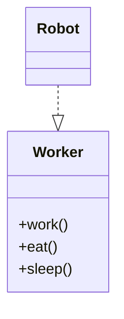
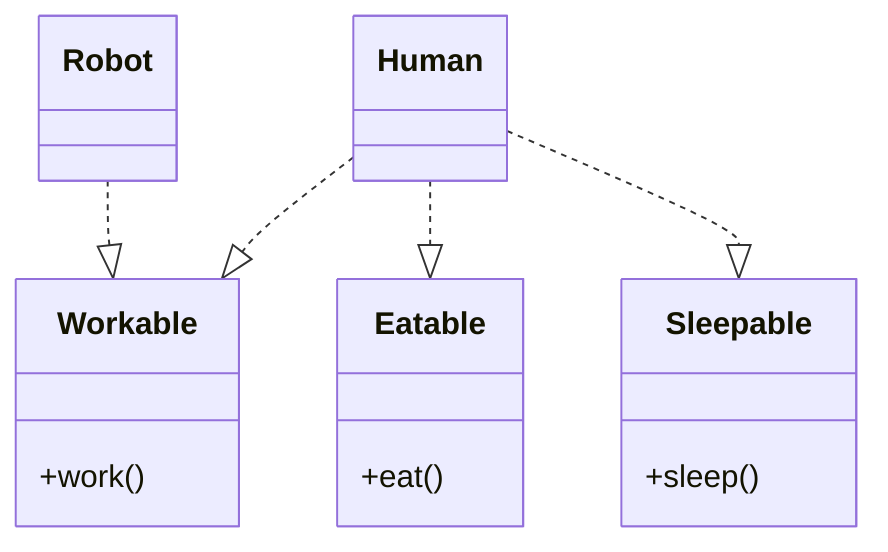

# 5. Interface Segregation Principle (ISP)
## Definition
> **Clients should not be forced to depend on interfaces they do not use.**
> They should not be forced to implement methods which they dont use. 
> Many client specific interfaces are better than one single generalized interface
---
## Core Idea
- Prefer **small, role-specific interfaces**
- Avoid **fat interfaces**
---
## ISP Violation

### Problem

- Robot does not eat or sleep but since it  inherits from Robot 
- Forced to implement meaningless methods 
---

## ISP-Compliant Design

---

## Key Insight

ISP is about **client perspective**, not implementation convenience.

---

## ISP Smell

- Interfaces with many unrelated methods
    
- Frequent “empty” method implementations
    

---
