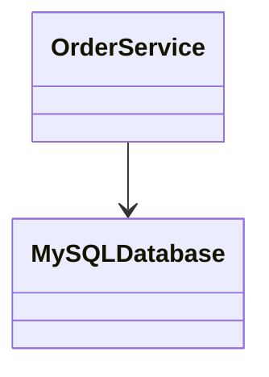
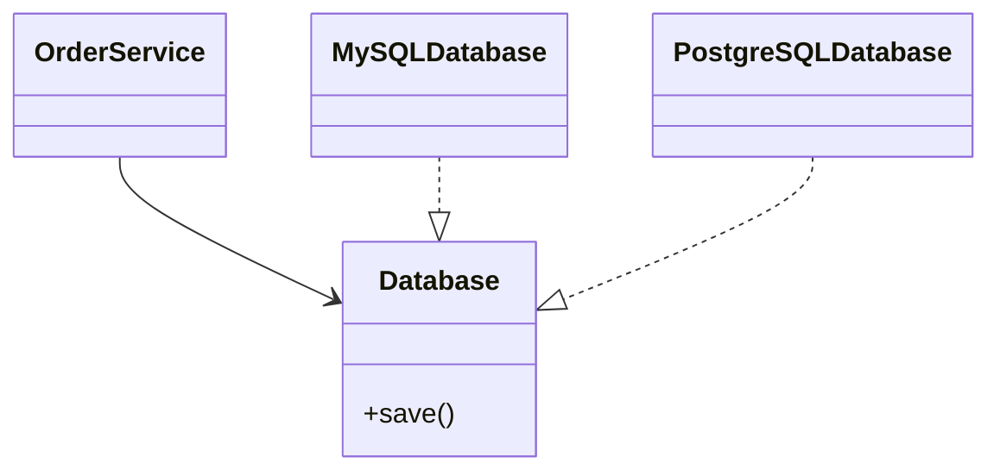

# 6. Dependency Inversion Principle (DIP)

## Definition

> **High-level modules should not depend on low-level modules.  
> Both should depend on abstractions.**

---
## What DIP Fixes
- Tight coupling
- Rigid architectures
- Difficult testing
---
## DIP Violation

### Problems

- Database change impacts business logic
- Hard to mock for tests
---
## DIP-Compliant Design

---

## Key Insight

DIP often enables:
- Dependency Injection
- Mocking
- Clean Architecture
- Hexagonal Architecture