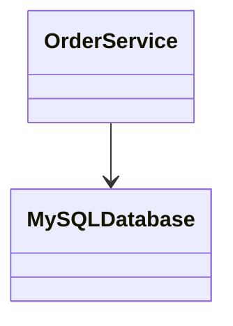
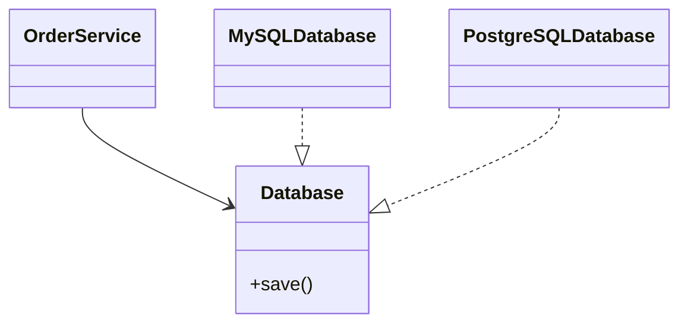

***Tags***: #lld #oops #SOLID #designpatterns
# 6. Dependency Inversion Principle (DIP)

## Definition

> **High-level modules should not depend on low-level modules.  
> Both should depend on abstractions.**

---
## What DIP Fixes
- Tight coupling
- Rigid architectures
- Difficult testing
---
## DIP Violation



### Problems

- Database change impacts business logic
- Hard to mock for tests
---
## DIP-Compliant Design



---

## Key Insight

DIP often enables:
- Dependency Injection
- Mocking
- Clean Architecture
- Hexagonal Architecture

❌ **Bad (tight coupling)**
```python
class MySQLDatabase:
    def save(self):
        print("Saved to MySQL")

class OrderService:
    def __init__(self):
        self.db = MySQLDatabase()

```

✅ **Good (depend on abstraction)**
```python
class Database:
    def save(self):
        pass

class MySQLDatabase(Database):
    def save(self):
        print("Saved to MySQL")

class OrderService:
    def __init__(self, db):
        self.db = db


db = MySQLDatabase()
service = OrderService(db)
service.db.save()

```