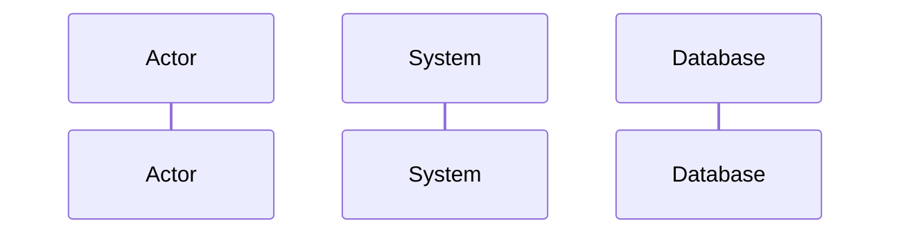
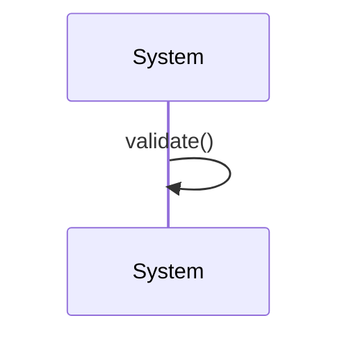
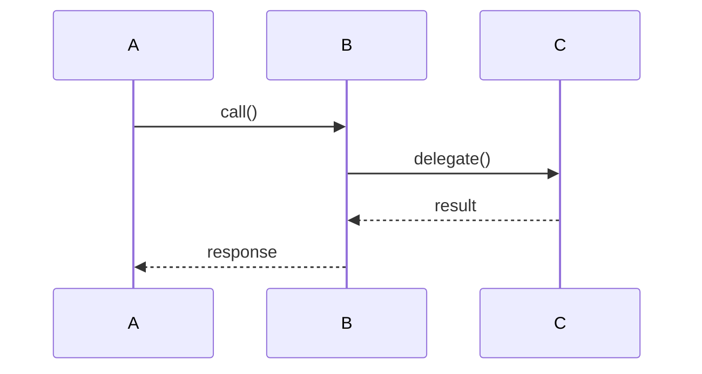
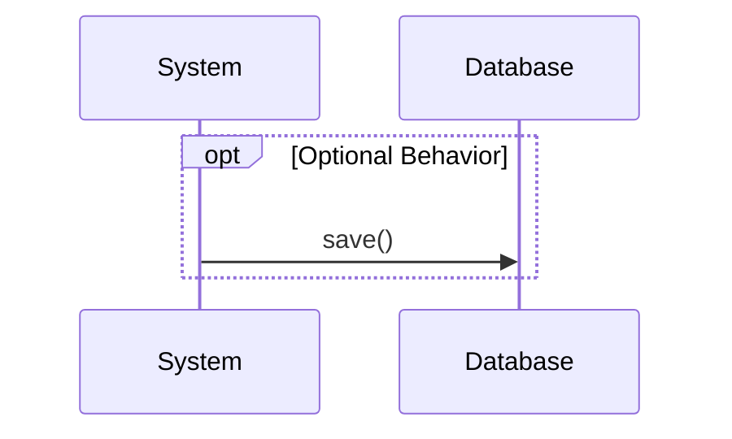
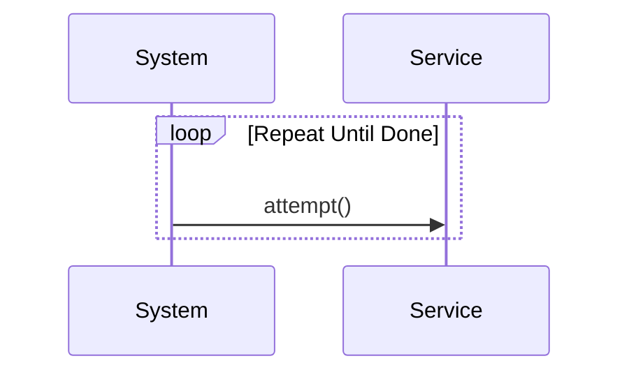
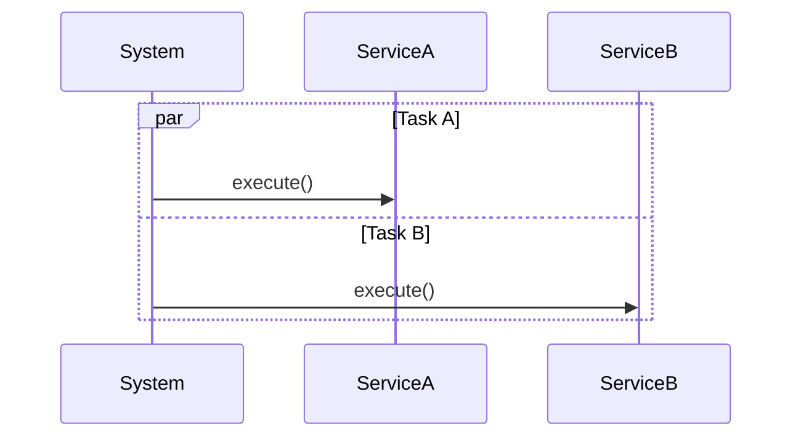
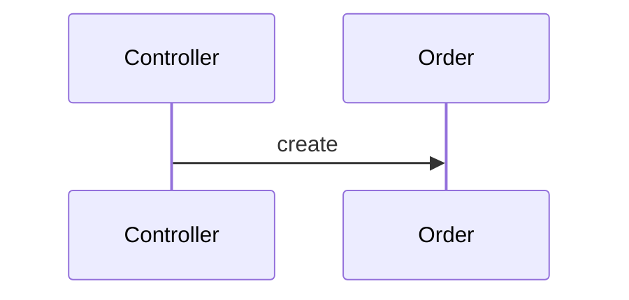
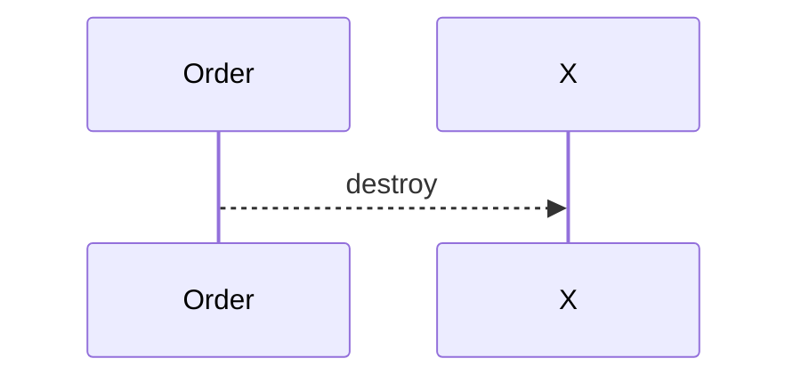
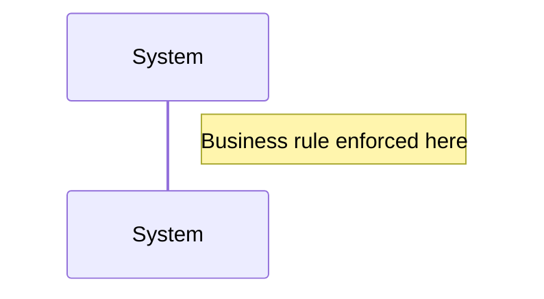

***Tags***: #lld #uml #oops #diagrams 
## What Is a Sequence Diagram?
A **sequence diagram** shows:
- **Who** is involved (objects / services)
- **Who talks to whom**
- **In what order**
- **Over time**
## Purpose
Sequence diagrams are used to:
- Describe a **single use case scenario**
- Visualize **object collaboration**
- Understand **control flow**
- Clarify **responsibilities**
---
##### Reference
![[Pasted image 20251228161158.png]]

---

##  Lifelines (Participants)

**Represents:** object / actor / external system  
UML Meaning
- Rectangle = instance name
- Dashed vertical line = lifeline

---
## Synchronous Message (Call)
![[Synchronous calls.png]]

- Caller **waits** until the operation completes
#### Arrow Explanation
- `->>` = synchronous call
- Solid line
- Filled arrowhead
---

## Reply (Return Message)
![[response.png]]

**Meaning:** return of control or data  
**Arrow:** dashed line

---

#### Activation (Execution Specification)
![[activation.png]]

**Shows:** when an instance is actively executing  
**Also called:** focus of control

---

#### Self Message

**Meaning:** internal processing within same instance

---

#### Interaction Chain (Multiple Lifelines)

**Shows:** collaboration & responsibility flow

---

#### `alt` Fragment (If–Else)

![[alt.png]]

**Rule:** only one path executes  
**Guards:** logical conditions

---

#### `opt` Fragment (Optional)

**Equivalent to:** single conditional path

---

#### `loop` Fragment (Repetition)

**Used for:** retries, iterations, polling

---

#### `par` Fragment (Parallel)

**Meaning:** concurrent interactions

---

#### Object Creation

**Rule:** lifeline starts at creation point

---

#### Object Destruction

**Meaning:** instance termination  
**Notation:** ❌ at lifeline end

---

#### Notes (Documentation)

**Purpose:** clarify rules, assumptions, constraints

