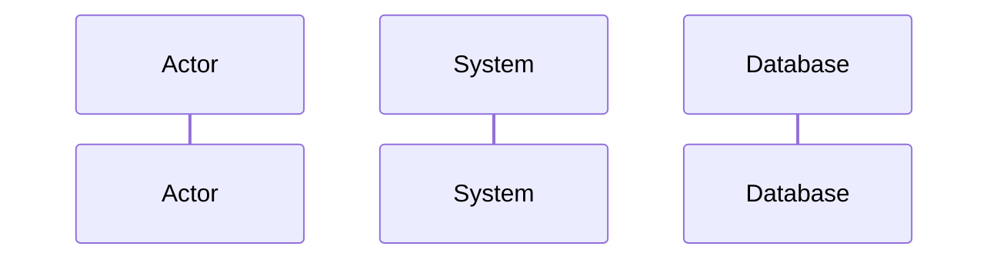
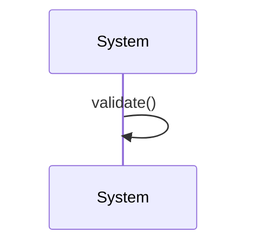
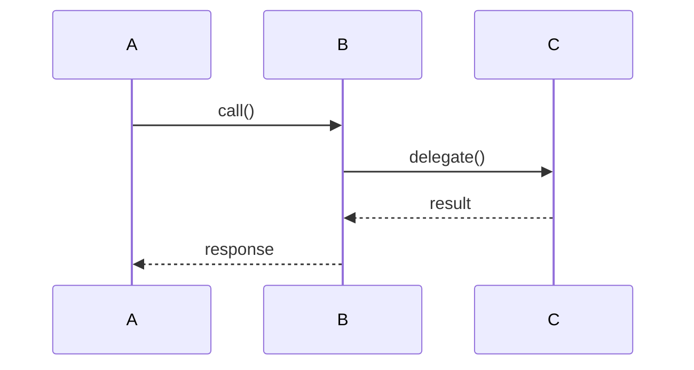
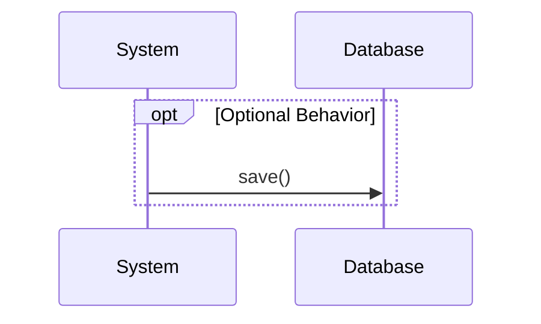
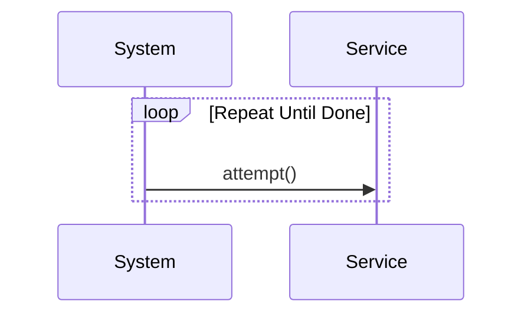
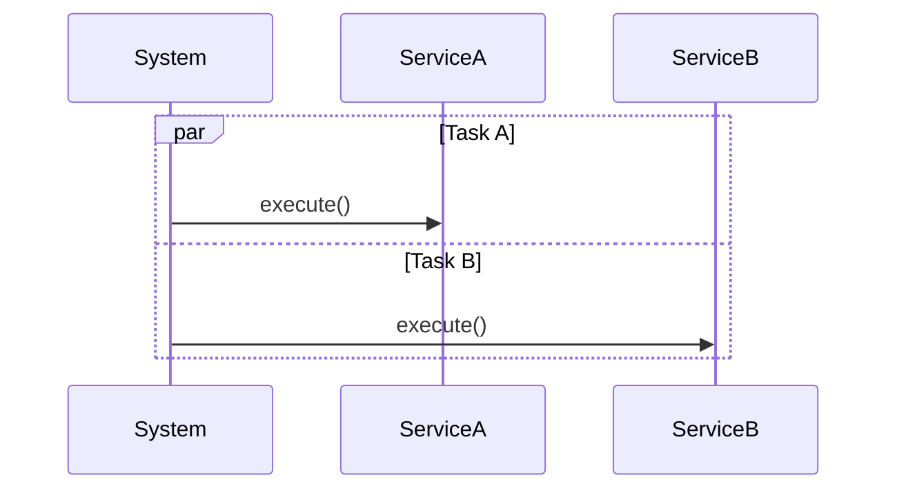
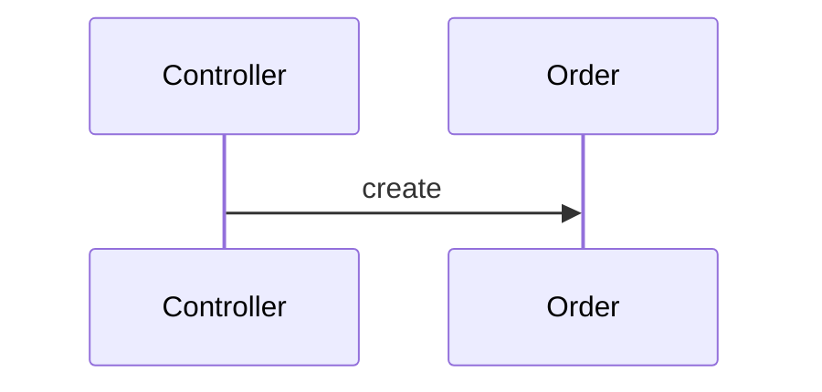
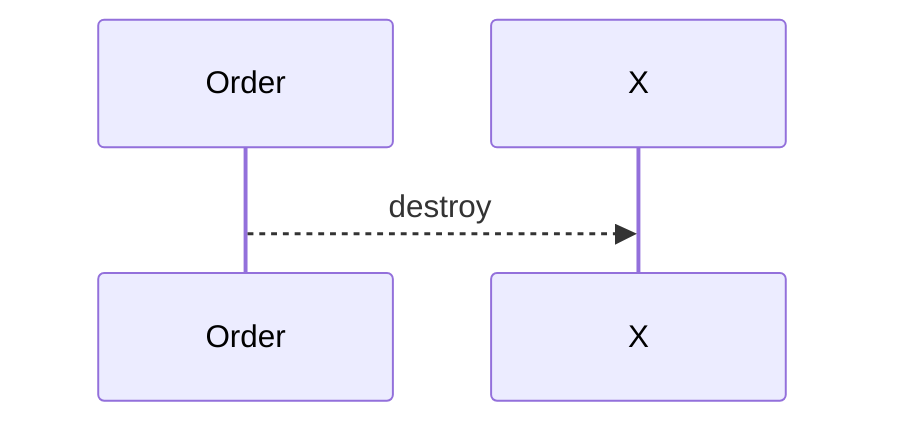
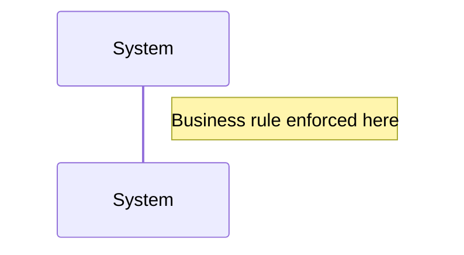

***Tags***: #lld #uml #oops #diagrams 
## What Is a Sequence Diagram?
A **sequence diagram** shows:
- **Who** is involved (objects / services)
- **Who talks to whom**
- **In what order**
- **Over time**
## Purpose
Sequence diagrams are used to:
- Describe a **single use case scenario**
- Visualize **object collaboration**
- Understand **control flow**
- Clarify **responsibilities**
---
##### Reference
![[Pasted image 20251228161158.png]]

---


##  Lifelines (Participants)



**Represents:** object / actor / external system  
UML Meaning
- Rectangle = instance name
- Dashed vertical line = lifeline

---
## Synchronous Message (Call)

```mermaid
sequenceDiagram
    Actor->>System: submitRequest
```

- Caller **waits** until the operation completes
- Most common message type
**Arrow:** solid line, filled arrowhead

---

## Reply (Return Message)

```mermaid
sequenceDiagram
    System-->>Actor: response
```

**Meaning:** return of control or data  
**Arrow:** dashed line

---

## 6️⃣ Activation (Execution Specification)

```mermaid
sequenceDiagram
    Actor->>System: process()
    activate System
    System-->>Actor: done
    deactivate System
```

**Shows:** when an instance is actively executing  
**Also called:** focus of control

---

## 7️⃣ Self Message



**Meaning:** internal processing within same instance

---

## 8️⃣ Interaction Chain (Multiple Lifelines)



**Shows:** collaboration & responsibility flow

---

## 9️⃣ `alt` Fragment (If–Else)

```mermaid
sequenceDiagram
    alt Condition True
        System-->>Actor: Success
    else Condition False
        System-->>Actor: Failure
    end
```

**Rule:** only one path executes  
**Guards:** logical conditions

---

## 🔟 `opt` Fragment (Optional)



**Equivalent to:** single conditional path

---

## 🔁 11️⃣ `loop` Fragment (Repetition)



**Used for:** retries, iterations, polling

---

## 🔀 12️⃣ `par` Fragment (Parallel)



**Meaning:** concurrent interactions

---

## 13️⃣ Object Creation



**Rule:** lifeline starts at creation point

---

## 14️⃣ Object Destruction



**Meaning:** instance termination  
**Notation:** ❌ at lifeline end

---

## 15️⃣ Notes (Documentation)



**Purpose:** clarify rules, assumptions, constraints

---

## 16️⃣ What Sequence Diagrams Emphasize

✔ Order of messages  
✔ Object collaboration  
✔ Runtime behavior  
✔ Responsibility distribution

---

## 17️⃣ What They Do NOT Show

✘ Algorithms  
✘ Data structures  
✘ Internal logic details  
✘ Class attributes

---

## 18️⃣ Final Mental Summary

> **Sequence diagrams model how instances collaborate through ordered message exchanges to realize a single scenario.**

---

If you want next, I can:

- Convert this into a **printable PDF**
    
- Create a **comparison cheat sheet (Sequence vs Activity vs Communication)**
    
- Add **exam & interview questions**
    
- Build a **real-world UML example step by step**
    

Just say what you want next.