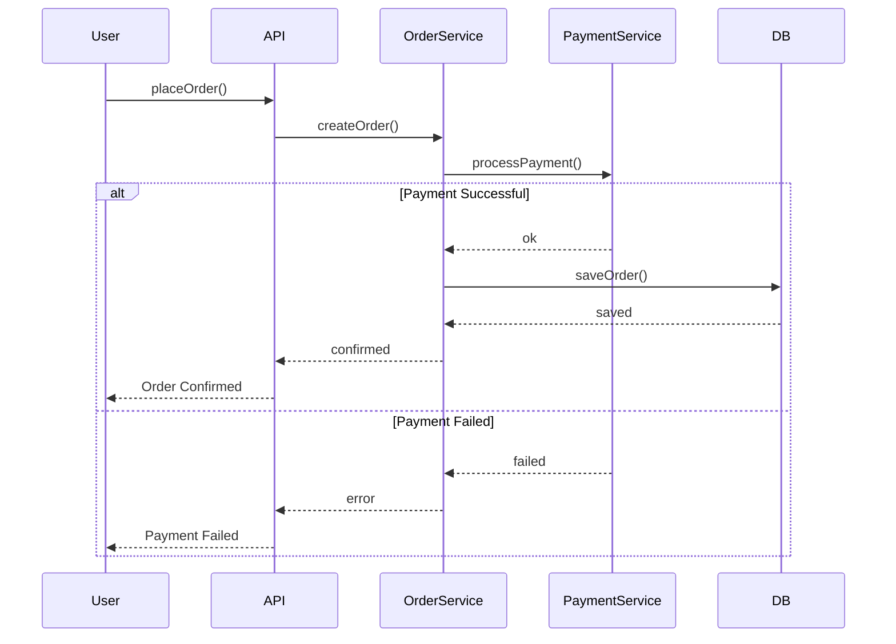

***Tags***: #lld #uml #oops #diagrams 
## What Is a Sequence Diagram?
A **sequence diagram** shows:

- **Who** is involved (objects / services)
- **Who talks to whom**
- **In what order**
- **Over time**
It answers this question:

> “When a feature runs, which objects interact, and in what exact sequence?”

---
#### Example
![[Pasted image 20251228161158.png]]

